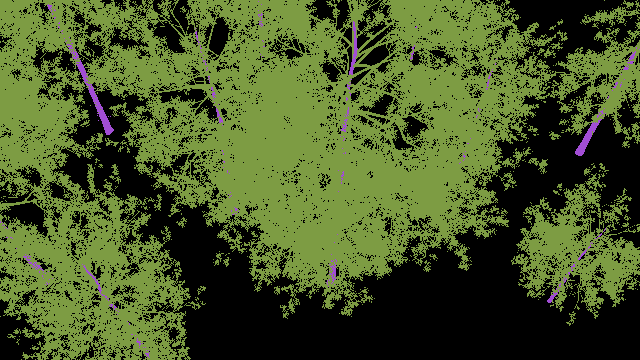
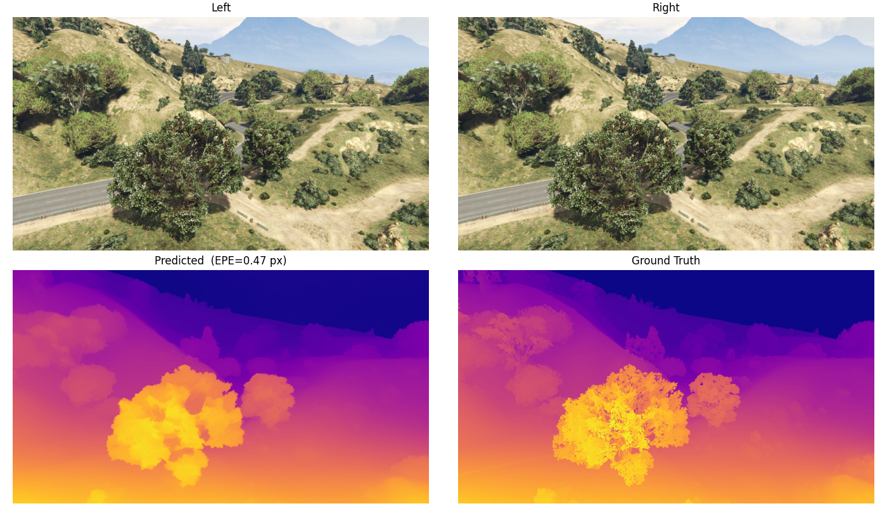
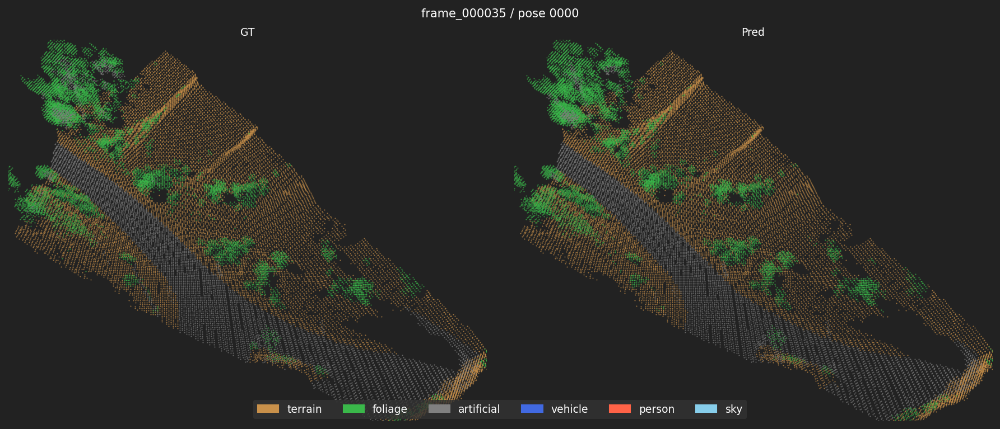

# aerosynth

Pipeline for synthetic aerial stereo dataset generation, stereo depth estimation, and point cloud semantic segmentation. Two data sources are supported: **SynthBlend** (procedurally rendered in Blender) and **GTA V** (captured with a custom ScriptHookV mod).

## Sample outputs

**SynthBlend** — rendered stereo scene with segmentation ground truth:

Left RGB | Segmentation
---|---
 | 

**RAFT-Stereo** — predicted vs ground-truth disparity on a GTA V frame:



**SimpleUNet** — oblique point cloud render, GT vs predicted segmentation:



## Components

| Component | Description |
|---|---|
| [SynthBlend](https://github.com/rorygh/SynthBlend) | Procedural stereo scene renderer — BlenderProc + fBm terrain + Poisson-disk tree placement. Outputs stereo RGB, depth, disparity, and category segmentation. |
| [aerosynth-gtav](https://github.com/rorygh/aerosynth-gtav) | GTA V ScriptHookV mod that captures aerial stereo imagery with depth (DirectX depth buffer) and segmentation (stencil buffer) ground truth. **Built and run on Windows** — see that repo's README for the MSVC build and install instructions. The Linux `setup-env.sh` is only needed for running `convert.py` to normalise captures for training. |
| [RAFT-Stereo](https://github.com/rorygh/RAFT-Stereo) | RAFT-Stereo fine-tuned on SynthBlend and GTA V data for stereo disparity estimation. |
| [SimpleUNet](https://github.com/rorygh/SimpleUNet) | Sparse voxel UNet trained on coloured point clouds back-projected from stereo depth. Segments terrain, foliage, and man-made structures. |

## Getting started on a fresh pod

**1. Machine setup** — download and run the bootstrap script before cloning:

```bash
curl -fsSL https://raw.githubusercontent.com/rorygh/aerosynth/master/setup-pod.sh | bash
```

Installs system packages, rclone, and Miniconda. Configures git identity and credential caching (you will be prompted for your GitHub credentials on the first clone).

**2. Clone the repo with all submodules:**

```bash
git clone --recurse-submodules https://github.com/rorygh/aerosynth.git /workspace/aerosynth
```

**3. Set up whichever components you need** — each has its own `setup-env.sh`:

```bash
# Data generation (SynthBlend)
cd /workspace/aerosynth/SynthBlend && bash setup-env.sh

# Stereo depth (RAFT-Stereo)
cd /workspace/aerosynth/RAFT-Stereo && bash setup-env.sh

# Point cloud segmentation (SimpleUNet)
cd /workspace/aerosynth/SimpleUNet && bash setup-env.sh

# GTA V data conversion only (the mod itself is built on Windows — see aerosynth-gtav README)
cd /workspace/aerosynth/aerosynth-gtav && bash setup-env.sh
```

Each component's README has full training and evaluation instructions.

## Workflow

```
SynthBlend / aerosynth-gtav
        │  stereo RGB + depth + segmentation ground truth
        ▼
   RAFT-Stereo  ──  fine-tune on stereo pairs, predict disparity
        │
   SimpleUNet   ──  back-project RGB+depth → 3D point cloud → segment
```

Both RAFT-Stereo and SimpleUNet are trained independently on either dataset. SimpleUNet uses ground-truth depth from the dataset directly (not RAFT output) during training.
