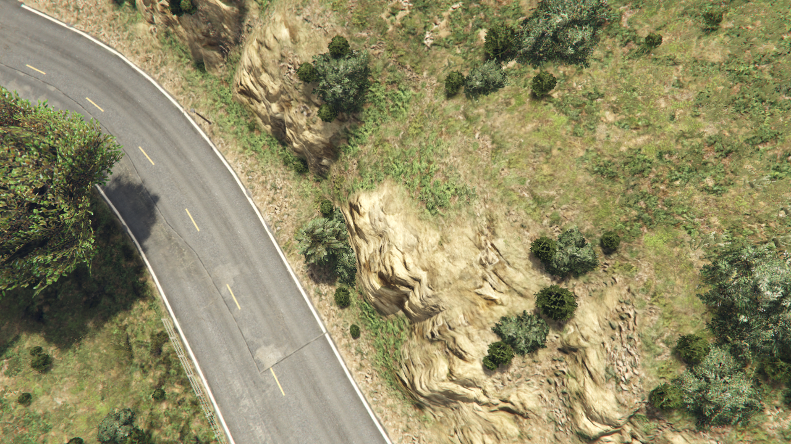
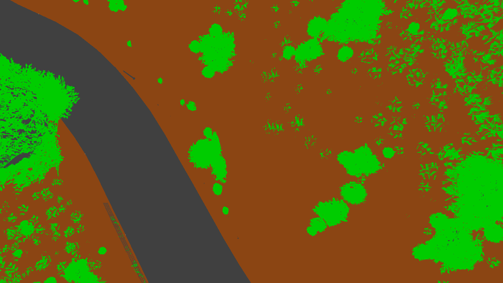
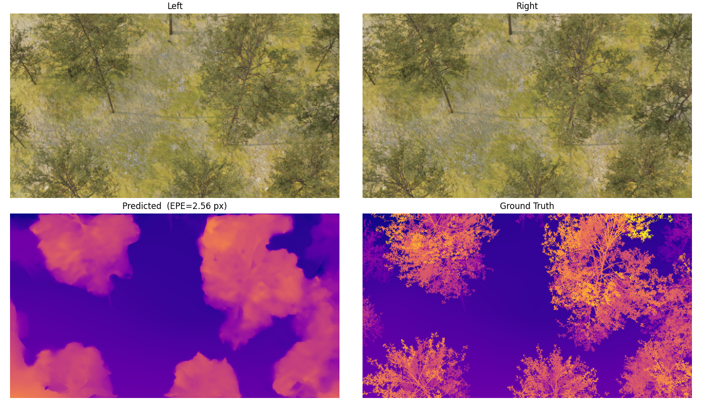
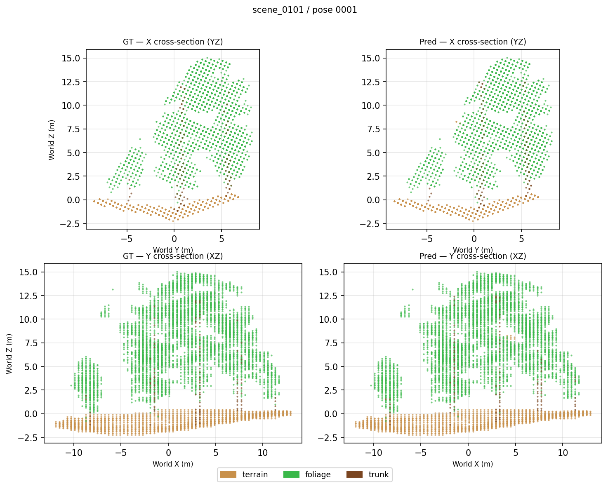

# aerosynth

Pipeline for synthetic aerial stereo dataset generation, stereo depth estimation, and point cloud semantic segmentation.

## Dataset generation

Two data sources are supported, each producing stereo RGB, depth, disparity, and semantic segmentation ground truth.

### SynthBlend

Procedural renderer using BlenderProc — fBm terrain, Poisson-disk tree placement, physically-based sky. Runs on Linux.

Left RGB | Segmentation (terrain · foliage · trunk)
---|---
 | 

### GTA V

ScriptHookV ASI mod that positions a scripted aerial camera and captures the DirectX depth buffer and stencil-based segmentation. **Built and run on Windows** — see [aerosynth-gtav](https://github.com/rorygh/aerosynth-gtav) for build and install instructions. A `convert.py` script normalises captures to the shared training format.

Left RGB | Segmentation (terrain · foliage · artificial · vehicle · person · sky)
---|---
 | 

## Stereo depth — RAFT-Stereo

RAFT-Stereo fine-tuned independently on each dataset. Each row shows left RGB, predicted disparity, and ground-truth disparity on a held-out frame.

**SynthBlend:**



**GTA V:**


See [RAFT-Stereo](https://github.com/rorygh/RAFT-Stereo) for results and training instructions.

## Point cloud segmentation — SimpleUNet

Sparse voxel UNet trained on coloured point clouds back-projected from stereo depth. Trained independently on each dataset.

**SynthBlend** — GT vs predicted cross-sections (terrain · foliage · trunk):



**GTA V** — oblique point cloud render, GT vs predicted (terrain · foliage · artificial · sky):


See [SimpleUNet](https://github.com/rorygh/SimpleUNet) for results and training instructions.

## Getting started on a fresh pod

**1.** Navigate to the workspace directory:

```bash
cd /workspace
```

**2.** If the repo is private, configure git to cache credentials so you are only prompted once:

```bash
git config --global credential.helper store
```

Then when you clone, git will prompt for your GitHub username and a personal access token, and cache them for all future operations.

**3.** Clone the repo with all submodules:

```bash
git clone --recurse-submodules https://github.com/rorygh/aerosynth.git
cd aerosynth
```

**4.** Run the machine setup script (installs system packages, rclone, and Miniconda):

```bash
bash setup-pod.sh
```

Then open a new shell (or `source ~/.bashrc`) for conda to be available.

**5.** Set up whichever components you need — each has its own `setup-env.sh`:

```bash
# Synthetic data generation
cd /workspace/aerosynth/SynthBlend && bash setup-env.sh

# Stereo depth estimation
cd /workspace/aerosynth/RAFT-Stereo && bash setup-env.sh

# Point cloud segmentation
cd /workspace/aerosynth/SimpleUNet && bash setup-env.sh

# GTA V data conversion only (mod itself is built on Windows)
cd /workspace/aerosynth/aerosynth-gtav && bash setup-env.sh
```

Each component's README has full training, evaluation, and visualisation instructions.
